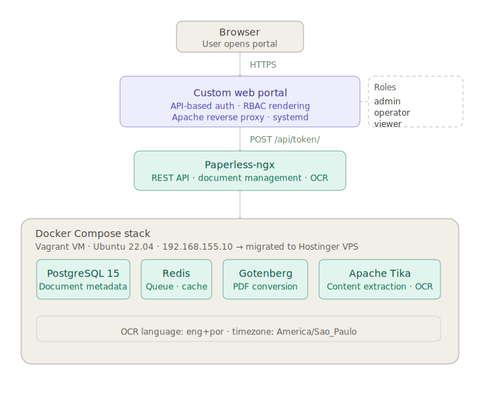

# Paperless Portal — Self-Hosted Document Management with API Auth & RBAC

A custom web portal built on top of **Paperless-ngx**, featuring API-based authentication and role-based access control (RBAC). Users authenticate directly via the Paperless-ngx API — the portal dynamically adapts its interface based on the authenticated user's role. Deployed locally via **Vagrant + Docker Compose**, then migrated to a **Hostinger cloud VPS**.

---

## What This Is

Paperless-ngx is a powerful self-hosted document management system, but its default interface is a single unified UI with no role differentiation. This project wraps it with a custom portal that:

- Authenticates users through the Paperless-ngx REST API (no separate user database)
- Determines the user's role after authentication
- Renders a different interface and feature set depending on that role
- Keeps all document storage and processing inside the existing Paperless-ngx stack

---

## Architecture

```
Browser
   │
   ▼
[ Custom Web Portal ]  ◄── Role-based UI rendering
   │
   │  API calls (token-based)
   ▼
[ Paperless-ngx API ]
   │
   ├── [ PostgreSQL 15 ]   — document metadata
   ├── [ Redis ]           — task queue / cache
   ├── [ Gotenberg ]       — document conversion
   └── [ Apache Tika ]     — content extraction / OCR
```

All backend services run via **Docker Compose**.

---

## Stack

| Component | Role |
|---|---|
| Paperless-ngx | Document management, OCR, REST API |
| PostgreSQL 15 | Metadata storage |
| Redis | Queue and cache |
| Gotenberg | PDF/document conversion |
| Apache Tika | Content extraction |
| Custom Portal | Auth layer + RBAC frontend |
| Docker Compose | Service orchestration |
| Apache (reverse proxy) | HTTPS termination, routing |

---

## Authentication Flow

```
1. User submits credentials on portal login form
2. Portal sends POST /api/token/ to Paperless-ngx
3. Paperless returns auth token (or 401)
4. Portal fetches user profile via /api/profile/ using the token
5. Role is determined from user group membership
6. Session established — UI rendered based on role
```

No credentials are stored by the portal. Every subsequent API call uses the Paperless token.

---

## Roles

| Role | Access |
|---|---|
| `admin` | Full document access, user overview, all tags/correspondents |
| `operator` | Upload, tag, search documents |
| `viewer` | Read-only access to assigned document sets |

Roles map directly to Paperless-ngx user groups — no separate role configuration needed in the portal.

---

## Local Setup (Vagrant + Docker Compose)

```bash
git clone https://github.com/roysakai/paperless-portal
cd paperless-portal

# Start the VM
vagrant up

# SSH in and start the stack
vagrant ssh
cd /opt/paperless
docker compose up -d

# Portal available at:
# http://192.168.155.10:8081
```

### VM Specs (Vagrant/KVM)

| Setting | Value |
|---|---|
| OS | Ubuntu 22.04 |
| IP | 192.168.155.10 |
| Hypervisor | KVM/Libvirt |
| Paperless port | 8081 |

---

## Cloud Deployment (Hostinger VPS)

After validating the full stack locally, the entire setup was migrated to a Hostinger VPS:

1. Exported PostgreSQL database from local VM
2. Transferred document archive and media volumes
3. Reprovisioned Docker Compose stack on the VPS
4. Configured Apache as reverse proxy with Let's Encrypt SSL
5. Configured systemd service for auto-restart on reboot
6. Validated all functionality post-migration with zero data loss

---

## Environment Variables

Key variables in `.env` (not committed — see `.env.example`):

```env
PAPERLESS_SECRET_KEY=
PAPERLESS_DBPASS=
PAPERLESS_REDIS_URL=redis://redis:6379
PAPERLESS_OCR_LANGUAGE=eng+por
PAPERLESS_TIME_ZONE=America/Sao_Paulo
PORTAL_SESSION_SECRET=
```

---

## OCR Configuration

Configured for bilingual OCR:

```
PAPERLESS_OCR_LANGUAGE=eng+por
```

Supports English and Brazilian Portuguese documents out of the box.

---

## Project Context

Built as a personal homelab project to explore Docker Compose orchestration, REST API integration, session-based auth, and RBAC — and to solve a real usability gap in Paperless-ngx's default interface. The full lifecycle — local development → validation → cloud migration — was completed in a single sprint.

---

## License

MIT
